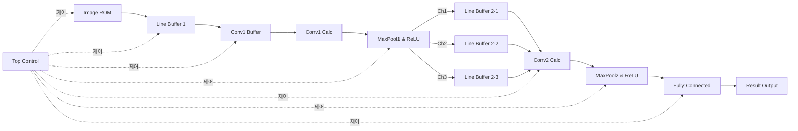
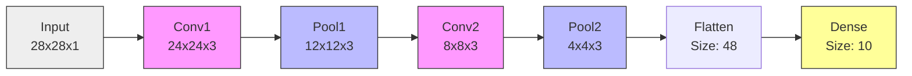

# 📘 FPGA CNN 가속기 완전 분석서 (Ultimate Deep Dive)

> **Project:** Handwritten Digit Recognition NPU on Zybo Z7-20  
> **Goal:** 코드 한 줄, 변수 하나까지 완벽하게 이해하기  
> **Level:** 초보자도 따라갈 수 있는 최대한 자세한 해설

---

## 📑 목차 (Table of Contents)

1. **[SW] 데이터 전처리 완전 분석**
2. **[SW] 가중치 추출 및 변환 전략**
3. **[SW] 양자화와 역양자화**
4. **[HW] 시스템 전체 구조**
5. **[HW] CNN 데이터 차원변화**
6. **[HW] 모듈별 코드 정밀 분석**
   - 6.1 Image ROM
   - 6.2 Line Buffer
   - 6.3 Conv1
   - 6.4 MaxPool & ReLU
   - 6.5 Conv2 (핵심)
   - 6.6 Fully Connected
   - 6.7 Top Control
7. **결론 및 성과**

---

## 1. [SW] 데이터 전처리 완전 분석

### 1.1 왜 이미지를 변환해야 하나?

FPGA는 JPG 파일을 직접 읽을 수 없습니다. 따라서 Python을 사용해 Verilog가 이해할 수 있는 **텍스트 배열(ROM)** 형태로 변환해야 합니다.

### 1.2 변환 과정 (Step-by-Step)

### 1.2 변환 과정 (Step-by-Step)

| 단계 | 처리 내용 | 설명 |
|------|-----------|------|
| **입력** | 원본 이미지 | RGB 또는 Grayscale |
| **1단계** | Grayscale 변환 | 컬러 이미지면 흑백으로 변환 (3채널 → 1채널) |
| **2단계** | 색상 반전 (Invert) | `new_pixel = 255 - old_pixel`<br>MNIST는 검은 배경에 흰 글씨이므로 포맷 일치 |
| **3단계** | 크기 조정 | 28×28로 리사이즈 (BILINEAR 보간법) |
| **4단계** | Scaling | `(pixel / 255.0) × 127`<br>Float32 → Int8 양자화로 메모리 75% 절약 |
| **5단계** | 코드 생성 | Verilog ROM 형태로 저장 |

### 1.3 핵심 코드 분석

```python
# [convert_image_to_rom.py 핵심 부분]

# 1. 이미지 로드 및 전처리
img = Image.open(image_path).convert('L')  # Grayscale 변환
img = ImageOps.invert(img)  # 색상 반전 (핵심!)
img = img.resize((28, 28), Image.BILINEAR)  # 크기 조정

# 2. Scaling (양자화)
img_array = np.array(img, dtype=np.float32)
scaled = (img_array / 255.0) * 127  # Float → Int8 범위로 변환
scaled = np.clip(scaled, -128, 127).astype(np.int8)  # 범위 제한

# 3. Verilog 코드 생성
with open('image_rom.v', 'w') as f:
    for addr, pixel in enumerate(scaled.flatten()):
        if pixel != 0:  # 희소 코딩: 0이 아닌 값만 저장
            f.write(f"    10'd{addr}: dout = 8'sd{pixel};\n")
    f.write("    default: dout = 8'd0;\n")  # 나머지는 0
```

**💡 왜 희소 코딩(Sparse Coding)을 사용하나?**
- MNIST 이미지는 대부분이 검은 배경(0)입니다.
- 784개(28×28) 픽셀 중 실제로 글씨가 있는 부분은 20~30%뿐
- 글씨가 있는 부분만 `case`문으로 정의하고, 나머지는 `default: 0`으로 처리하면 코드 길이가 70% 줄어듭니다!

---

## 2. [SW] 가중치 추출 및 변환 전략

### 2.1 문제: Keras와 FPGA의 데이터 읽기 순서 차이

| 플랫폼 | 저장 순서 | 이유 |
|--------|-----------|------|
| **Keras (SW)** | `(Height, Width, Channel)` | 이미지 처리 라이브러리 표준 |
| **FPGA (HW)** | 레이어마다 다름 | 하드웨어 연산 효율을 위해 최적화 필요 |

### 2.2 레이어별 변환 전략 (Transpose Strategy)

```python
# [generate_weights.py 핵심 로직]

# === Conv1 가중치 추출 ===
w_conv1 = model.layers[0].get_weights()[0]  # Shape: (5, 5, 1, 3)
# Keras 순서: (Row, Col, In, Out)
# FPGA 순서: (Out, Row, Col, In) ← 필터별로 모듈을 나누기 위함

w_conv1_T = w_conv1.transpose(3, 0, 1, 2)  # 순서 변경

for out_ch in range(3):  # 출력 필터 3개
    for r in range(5):   # 5x5 윈도우
        for c in range(5):
            val = w_conv1_T[out_ch, r, c, 0]
            # 파일에 8'shXX 형태로 저장

# === Conv2 가중치 추출 (핵심!) ===
w_conv2 = model.layers[2].get_weights()[0]  # Shape: (5, 5, 3, 3)
# Keras 순서: (Row, Col, In, Out)
# FPGA 순서: (Out, In, Row, Col) ← 이게 핵심!

w_conv2_T = w_conv2.transpose(3, 2, 0, 1)  # 순서 변경

for out_ch in range(3):   # 1. 출력 필터별로 방을 만듦
    for in_ch in range(3):  # 2. 그 안에서 입력 채널별로 나눔
        for r in range(5):  # 3. 5x5 윈도우를 훑음
            for c in range(5):
                val = w_conv2_T[out_ch, in_ch, r, c]
                # 파일에 저장
```

**💡 Conv2는 왜 (Out, In, Row, Col) 순서인가?**

이게 이 프로젝트의 핵심입니다!

```plaintext
[Conv1을 통과한 데이터]
┌─────────┐ ┌─────────┐ ┌─────────┐
│ Channel1│ │ Channel2│ │ Channel3│  ← 3장의 종이처럼 쌓여있음
│ (14x14) │ │ (14x14) │ │ (14x14) │
└─────────┘ └─────────┘ └─────────┘

[FPGA의 Conv2 동작]
하나의 필터(Out)가 3장을 동시에 뚫고 들어가며 읽어야 함!
      ↓
필터 1개당 = [Ch1의 5x5] + [Ch2의 5x5] + [Ch3의 5x5]를 모두 합산
      ↓
그래서 가중치도 (필터번호, 채널번호, Row, Col) 순서로 묶어둬야 함!
```

### 2.3 각 계층 가중치 구조 변환

Keras(Python)는 `HWC` 순서를 쓰지만, FPGA는 연산 효율을 위해 **순서를 재배열(Transpose)** 해야 합니다. 핵심 전략은 **"Out-In-Row-Col"** 입니다.

##### 계층별 변환 공식 요약

| 계층 (Layer) | Keras 원본 (Shape) | **FPGA 변환 (Transpose)** | **최종 형태** | **이유 (Rationale)** |
| :--- | :--- | :--- | :--- | :--- |
| **Conv1** | `(5, 5, 1, 3)`<br>(Row, Col, In, Out) | **`.transpose(3, 0, 1, 2)`** | **(Out, Row, Col, In)** | 출력 필터 3개(Out)를 기준으로 모듈이 나뉘므로 Out을 맨 앞으로 배치. |
| **Conv2** | `(5, 5, 3, 3)`<br>(Row, Col, In, Out) | **`.transpose(3, 2, 0, 1)`** | **(Out, In, Row, Col)** | **[핵심]** 필터 1개가 **입력 채널 3개(In)를 동시에** 읽어야 하므로, 입력 채널끼리 묶어둠. |
| **FC** | `(48, 10)`<br>(Input, Neuron) | **`.transpose(1, 0)`** | **(Neuron, Input)** | 각 뉴런(0~9)이 48개의 입력을 순차적으로 받아 계산하기 위함. |

####  Why Conv2 is `3, 2, 0, 1`?

1. **Keras 원본:** `(행, 열, 입력채널, 출력채널)` 순서입니다. 이는 소프트웨어에서 이미지를 한 장씩 넘겨보기에 적합합니다.
2. **FPGA 설계:**
* 우리는 `conv2_calc_1`, `conv2_calc_2` 처럼 **출력 필터(Out)** 별로 하드웨어 모듈을 따로 만들었습니다.  **Out(3)이 맨 앞으로!**
* 각 모듈 안에서는 버퍼 3개를 통해 **입력 3장(In)**을 동시에 펼쳐놓고 봅니다.  **In(2)이 두 번째로!**
* 마지막으로 5x5 윈도우를 훑습니다.  **Row(0), Col(1)이 뒤로!**

---
## 3. [SW] 양자화와 역양자화

### 3.1 양자화 및 연산 로직 (Quantization Logic)

FPGA 리소스를 아끼기 위해 **8-bit Integer (Int8)**를 사용하며, 이에 따른 스케일링 로직이 필요합니다.

#### ① Why Scale Factor 127? (왜 하필 127인가?)

* **자료형:** `signed 8-bit integer` (표현 범위: `-128` ~ `+127`)
* **정밀도 최대화:** 실수 `0.0` ~ `1.0` 사이의 값을 담을 때, 해상도를 높이려면 표현 가능한 **가장 큰 양수(127)**를 곱해야 합니다.
* Scale 10 사용 시:  (비트 낭비 심함)
* **Scale 127 사용 시:**  (비트를 꽉 채워 정보 손실 최소화)


#### ② What is `>>> 7`? (리스케일링의 정체)

이 연산은 **"리스케일링(Re-scaling)"**입니다. (역양자화가 아닙니다!)

1. **스케일 폭발:** 입력(배)  가중치(배) 곱셈을 하면, 결과는 **$2^{14}$배(16,384배)**로 커집니다.
2. **원상 복구:** 다음 층에 전달하기 전에 다시 배 수준으로 줄여야 합니다.
3. **비트 시프트:** $2^7(128)$로 나누는 것은 하드웨어적으로 **오른쪽으로 7칸 미는 것(`>>> 7`)**과 동일하며, 비용이 거의 들지 않는 효율적인 연산입니다.

#### ③ Why NO De-quantization? (왜 역양자화가 필요 없는가?)

보통 딥러닝 추론 끝에는 다시 실수(Float)로 바꾸지만, 우리는 그럴 필요가 없습니다.

* **목적:** 우리는 "누가 점수가 제일 높은가(**Argmax**)"만 알면 됩니다.
* **대소 관계 보존:** 모든 값에 똑같이 127이 곱해져 있어도, **숫자의 크기 순서(등수)는 변하지 않습니다.**
* Float:  (4가 1등)
* Int:  (여전히 4가 1등)


* **결론:** 굳이 자원을 써가며 실수로 되돌릴 필요 없이, 정수 상태에서 비교해도 **결과는 100% 동일**합니다.

---

## 4. [HW] 시스템 전체 구조

### 4.1 블록다이어그램



### 4.2 클럭 전략

```verilog
// [cnn_top.v]
// 입력 클럭: 125 MHz (Zybo 기본)
// 출력 클럭: 25 MHz (1/5로 분주)

wire clk_25mhz;
clk_divider #(.DIV_FACTOR(5)) clk_div (
    .clk_in(clk),
    .rst(reset),
    .clk_out(clk_25mhz)
);
```

**💡 왜 25MHz로 느리게 동작시키나?**

1. **타이밍 여유 확보**: Conv2의 복잡한 덧셈 트리(Adder Tree)가 한 사이클(40ns) 내에 안전하게 완료되도록
2. **초보자 친화적**: 라우팅 지연 문제를 하드웨어적으로 예방
3. **디버깅 용이**: 느린 클럭은 시뮬레이션에서 파형을 보기 쉬움

---
네, 맞습니다! 사용자님이 작성하신 Keras 코드를 보니 **"Max Pooling"**을 사용하신 게 확실합니다.

**왜 Max Pooling을 썼을까요?**
그냥 Pooling(Average 등)보다 **Max Pooling**이 이미지 인식에서 훨씬 많이 쓰입니다. 가장 큰 값(가장 뚜렷한 특징, 예: 가장 밝은 점이나 가장 선명한 모서리)만 남기고 나머지는 버리기 때문에, **"노이즈는 줄이고 핵심 특징만 진하게 남기는 효과"**가 있기 때문입니다.

요청하신 **[데이터 흐름에 따른 차원(Dimension) 변화]** 내용을 아주 깔끔하게 정리해 드립니다.
이 내용을 **보고서의 `2.1 AI 모델 구조**` 쯤에 넣으시면 완벽합니다.

아래 내용을 복사해서 사용하세요!

---

## [HW] 5. CNN 레이어별 데이터 차원 변화 (Data Flow)

Keras 모델 구조에 따라 입력 이미지가 어떻게 변환되는지 단계별로 분석합니다.

### 5.1 기본 공식 (Calculation Formula)

* **Conv2D (Valid Padding):** `(입력 크기 - 커널 크기) + 1`
* 커널이 이미지를 갉아먹으면서 지나가기 때문에 외곽 부분이 줄어듭니다.


* **MaxPooling2D (2x2):** `입력 크기 / 2`
* 가로, 세로를 각각 절반으로 줄입니다.


### 5.2 단계별 차원 변화 (Step-by-Step)

#### ① Input Layer

* **입력:** **`28 x 28 x 1`** (흑백 이미지)

#### ② Layer 1: Conv2D (Filter=3, Kernel=5x5)

* **연산:** 
* **변화:** `28 x 28 x 1`  **`24 x 24 x 3`**
* **설명:** 5x5 필터가 훑고 지나가면서 크기가 약간 줄어들고, 필터가 3개이므로 두께(Channel)가 3장이 됩니다.

#### ③ Layer 2: MaxPooling2D (2x2)

* **연산:** 
* **변화:** `24 x 24 x 3`  **`12 x 12 x 3`**
* **설명:** 이미지를 2x2 영역으로 나누어 가장 큰 값만 남깁니다. 크기가 정확히 절반으로 줍니다.

#### ④ Layer 3: Conv2D (Filter=3, Kernel=5x5)

* **연산:** 
* **변화:** `12 x 12 x 3`  **`8 x 8 x 3`**
* **설명:** 다시 5x5 필터가 특징을 추출하며 크기가 줄어듭니다. 필터 개수는 여전히 3개이므로 두께는 유지됩니다.

#### ⑤ Layer 4: MaxPooling2D (2x2)

* **연산:** 
* **변화:** `8 x 8 x 3`  **`4 x 4 x 3`**
* **설명:** 최종적으로 특징맵의 크기를 절반으로 줄입니다.

#### ⑥ Layer 5: Flatten (평탄화)

* **연산:** 
* **변화:** `4 x 4 x 3`  **`48 (1D Vector)`**
* **설명:** 3차원 입체 데이터를 일렬로 쫙 펴서 1차원 배열로 만듭니다.

#### ⑦ Layer 6: Dense (Output)

* **변화:** `48`  **`10`**
* **설명:** 48개의 입력 특징을 종합하여 0~9까지의 숫자일 확률(점수) 10개를 출력합니다.

---

### 5.3  요약표 (Summary Table)

| 단계 | 레이어 (Layer) | 입력 크기 (Input) | 연산 (Kernel/Pool) | 출력 크기 (Output) | 비고 |
| --- | --- | --- | --- | --- | --- |
| **0** | **Input Image** | - | - | **28 x 28 x 1** | MNIST 원본 |
| **1** | **Conv 1** | 28 x 28 x 1 | 5x5, Valid | **24 x 24 x 3** | 외곽 2픽셀씩 감소 |
| **2** | **Max Pool 1** | 24 x 24 x 3 | 2x2 | **12 x 12 x 3** | 크기 1/2 축소 |
| **3** | **Conv 2** | 12 x 12 x 3 | 5x5, Valid | **8 x 8 x 3** | 외곽 2픽셀씩 감소 |
| **4** | **Max Pool 2** | 8 x 8 x 3 | 2x2 | **4 x 4 x 3** | 크기 1/2 축소 |
| **5** | **Flatten** | 4 x 4 x 3 | - | **48** | 1차원 변환 |
| **6** | **Dense (FC)** | 48 | - | **10** | 최종 분류 (0~9) |

---

### 5.4 구조도 시각화 (Architecture Diagram)



--
## 6. [HW] 모듈별 코드 정밀 분석

### 6.1 Image ROM (FPGA의 망막)

```verilog
// [image_rom.v]
module image_rom(
    input wire [9:0] addr,    // 주소 (0~783)
    output reg signed [7:0] dout  // 픽셀 값 (-128~127)
);

always @(*) begin
    case(addr)
        // 희소 코딩: 글씨가 있는 부분만 정의
        10'd121: dout = 8'sd6;
        10'd122: dout = 8'sd18;
        // ... (중간 생략) ...
        10'd655: dout = 8'sd127;
        
        // 나머지는 모두 0 (검은 배경)
        default: dout = 8'sd0;
    endcase
end

endmodule
```

**💡 코드 해설**

- `addr`: ROM의 주소 (0~783 = 28×28)
- `dout`: 해당 주소의 픽셀 값
- `case(addr)`: 주소에 따라 다른 값을 출력 (Look-Up Table)
- `default: 0`: 정의되지 않은 주소는 모두 0 (검은 배경)

**동작 원리:**
```plaintext
Top Control이 addr = 0, 1, 2, ... 순서대로 요청
   ↓
ROM은 미리 저장된 값을 꺼내서 dout으로 출력
   ↓
Line Buffer가 이를 받아서 저장
```

---

### 6.2 Line Buffer (윈도우 슬라이딩의 마법)

**핵심 아이디어:** 이미지 전체(28×28 = 784픽셀)를 저장하면 메모리가 부족하다. 따라서 **딱 5줄(5×28 = 140픽셀)**만 저장해서 재활용한다!

```verilog
// [line_buffer.v 핵심 부분]

// 5줄을 저장하는 버퍼 (Shift Register)
reg signed [7:0] buffer [0:WIDTH*HEIGHT-1];  // WIDTH=28, HEIGHT=5

always @(posedge clk) begin
    if (valid_in) begin
        // [Shift Register 로직]
        // "모두 한 칸씩 옆방으로 이동하세요!"
        buffer[139] <= buffer[138];  // 가장 오래된 데이터
        buffer[138] <= buffer[137];
        // ... (중간 생략) ...
        buffer[1] <= buffer[0];
        buffer[0] <= pixel_in;  // 새 데이터 입장
    end
end

// [Window Output 로직]
// 5×5 창문에 해당하는 25개 픽셀을 동시에 출력
always @(*) begin
    // current_idx: 현재 창문의 왼쪽 위 모서리 위치
    
    // 첫 번째 줄 (Row 0)
    data_out_0 = buffer[current_idx];      // (0,0)
    data_out_1 = buffer[current_idx + 1];  // (0,1)
    data_out_2 = buffer[current_idx + 2];  // (0,2)
    data_out_3 = buffer[current_idx + 3];  // (0,3)
    data_out_4 = buffer[current_idx + 4];  // (0,4)
    
    // 두 번째 줄 (Row 1) - WIDTH(28)만큼 건너뛰면 아랫줄
    data_out_5 = buffer[current_idx + 28];     // (1,0)
    data_out_6 = buffer[current_idx + 28 + 1]; // (1,1)
    // ... (중간 생략) ...
    
    // 다섯 번째 줄 (Row 4)
    data_out_20 = buffer[current_idx + 28*4];     // (4,0)
    data_out_21 = buffer[current_idx + 28*4 + 1]; // (4,1)
    // ... (이하 생략) ...
end
```

**💡 동작 원리 (시각화)**

```plaintext
[초기 상태: 첫 5줄이 들어옴]
buffer[0~27]:   Row 0 (최신)
buffer[28~55]:  Row 1
buffer[56~83]:  Row 2
buffer[84~111]: Row 3
buffer[112~139]: Row 4 (가장 오래됨)

current_idx = 0일 때 → 5x5 창문이 이미지 좌상단을 가리킴
┌───┬───┬───┬───┬───┐
│ 0 │ 1 │ 2 │ 3 │ 4 │ ← Row 0
├───┼───┼───┼───┼───┤
│28 │29 │30 │31 │32 │ ← Row 1
├───┼───┼───┼───┼───┤
│56 │57 │58 │59 │60 │ ← Row 2
├───┼───┼───┼───┼───┤
│84 │85 │86 │87 │88 │ ← Row 3
├───┼───┼───┼───┼───┤
│112│113│114│115│116│ ← Row 4
└───┴───┴───┴───┴───┘

[새로운 픽셀이 들어오면]
1. 모든 데이터가 한 칸씩 뒤로 밀림 (Shift)
2. buffer[0]에 새 픽셀이 들어감
3. buffer[139]에 있던 가장 오래된 데이터는 사라짐

[창문 이동]
current_idx++하면 창문이 오른쪽으로 한 칸 이동
한 줄(28픽셀)을 다 읽으면 창문이 아래로 한 줄 내려감
```

**💡 왜 이렇게 복잡하게 하나?**

만약 이미지 전체를 저장하면:
- 메모리: 28×28 = 784개 레지스터 필요
- Line Buffer: 5×28 = 140개 레지스터만 필요
- **절약률: 82%!**

---

### 6.3 Conv1 (단일 채널 연산)

Conv1은 입력이 1채널(흑백)이므로 구조가 비교적 단순합니다.

**[conv1_buf.v] - 랩 어라운드 방지**

```verilog
// 입력: Line Buffer에서 나온 25개 픽셀
// 출력: 계산에 사용할 25개 픽셀 (유효성 검사 포함)

always @(posedge clk) begin
    if (soft_rst) begin
        row_cnt <= 0;
        col_cnt <= 0;
        valid_out_buf <= 0;
    end
    else if (valid_in) begin
        // [핵심] 랩 어라운드 방지
        // 이미지 끝(27, 28번 픽셀)에서는 출력을 차단
        valid_out_buf <= (row_cnt >= 4) && 
                         (col_cnt >= 3 && col_cnt <= 26);
        
        // 열 카운터
        if (col_cnt == 27) begin
            col_cnt <= 0;
            row_cnt <= row_cnt + 1;
        end else begin
            col_cnt <= col_cnt + 1;
        end
    end
end
```

**💡 랩 어라운드(Wrap-around)가 뭔가요?**

```plaintext
[이미지 한 줄 끝]
... [24] [25] [26] [27] | [0] [1] [2] ...
                  ↑ 끝    ↑ 다음 줄 시작

[5x5 창문이 27번 픽셀을 중심으로 있을 때]
┌───┬───┬───┬───┬───┐
│23 │24 │25 │26 │27 │
├───┼───┼───┼───┼───┤
│... 정상 데이터  │ X │ ← 여기는 다음 줄 데이터!
└───┴───┴───┴───┴───┘

이렇게 되면 왼쪽 끝과 오른쪽 끝이 섞여서 엉뚱한 결과가 나옴!

[해결책]
col_cnt가 27, 28일 때는 valid_out_buf = 0으로 만들어서
Conv1_calc가 계산하지 않도록 차단!
```

**[conv1_calc.v] - 파이프라인 연산**

```verilog
// 파이프라인 단계 (P_STAGES = 7)
parameter P_STAGES = 7;

// [Stage 0: 데이터 캡처]
always @(posedge clk) begin
    if (valid_out_buf) begin
        // 25개 픽셀을 레지스터에 찰칵! (스냅샷)
        p_s0[0] <= data_out_0;
        p_s0[1] <= data_out_1;
        // ... (중간 생략) ...
        p_s0[24] <= data_out_24;
    end
end

// [Stage 1: 병렬 곱셈]
always @(posedge clk) begin
    for (i = 0; i < 25; i = i + 1) begin
        // 필터 3개 × 25픽셀 = 75개 곱셈기가 동시에 돌아감!
        product1_s1[i] <= $signed(p_s0[i]) * get_w1(i);  // Filter 1
        product2_s1[i] <= $signed(p_s0[i]) * get_w2(i);  // Filter 2
        product3_s1[i] <= $signed(p_s0[i]) * get_w3(i);  // Filter 3
    end
end

// [Stage 2: Adder Tree Level 1]
// 25개 → 13개로 압축
always @(posedge clk) begin
    for (i = 0; i < 12; i = i + 1) begin
        // 짝지어서 더하기 (토너먼트 방식)
        sum1_s2[i] <= product1_s1[2*i] + product1_s1[2*i+1];
        sum2_s2[i] <= product2_s1[2*i] + product2_s1[2*i+1];
        sum3_s2[i] <= product3_s1[2*i] + product3_s1[2*i+1];
    end
    // 짝이 없는 마지막 하나는 그냥 통과
    sum1_s2[12] <= product1_s1[24];
    sum2_s2[12] <= product2_s1[24];
    sum3_s2[12] <= product3_s1[24];
end

// [Stage 3~5: 계속 압축]
// 13 → 7 → 4 → 2 ...

// [Stage 6: 최종 합산]
always @(posedge clk) begin
    sum1_s6 <= sum1_s5[0] + sum1_s5[1];  // Filter 1 총합
    sum2_s6 <= sum2_s5[0] + sum2_s5[1];  // Filter 2 총합
    sum3_s6 <= sum3_s5[0] + sum3_s5[1];  // Filter 3 총합
end

// [Output: 리스케일링 & 바이어스]
always @(posedge clk) begin
    if (valid_pipe[P_STAGES-1]) begin
        // >>> 7: 우측 시프트 (÷128과 같은 효과)
        // + bias: 학습된 편향값 더하기
        conv_out_1 <= ($signed(sum1_s6) >>> 7) + b1;
        conv_out_2 <= ($signed(sum2_s6) >>> 7) + b2;
        conv_out_3 <= ($signed(sum3_s6) >>> 7) + b3;
    end
end
```

**💡 왜 Adder Tree를 사용하나?**

```plaintext
[방법 1: 순차 덧셈 (Chain)]
result = A + B + C + D + ... + Y + Z

문제: 전기 신호가 A부터 Z까지 긴 길을 지나야 함
     → Critical Path가 길어져서 고속 동작 불가!

[방법 2: 트리 덧셈 (Tree)]
Level 1: (A+B), (C+D), (E+F), ... (병렬 처리)
Level 2: (A+B)+(C+D), (E+F)+(G+H), ...
Level 3: ...
최종: 모든 값의 합

장점: Critical Path가 log₂(N)으로 짧아짐
     → 고속 동작 가능!

[본 프로젝트]
25개 → 13개 → 7개 → 4개 → 2개 → 1개
(5단계만에 완료)
```

**💡 >>> 7 (우측 시프트)가 뭔가요?**

```plaintext
[문제 상황]
8-bit × 8-bit = 16-bit (숫자가 256배 커짐)
실제로는 127 × 127 = 16,129 (128배 뻥튀기)

[해결]
÷128을 하면 원래 크기로 돌아옴

[하드웨어 구현]
나눗셈(/)은 회로가 복잡하고 느림
→ 비트 시프트(>>>)로 대체!

>>> 1 = ÷2
>>> 2 = ÷4
>>> 3 = ÷8
>>> 7 = ÷128 ← 우리가 원하는 것!

[예시]
16,129 (이진수: 0011111100000001)
>>> 7
= 126 (이진수: 01111110)
```

---

### 6.4 MaxPool & ReLU (2x2 승자 독식)

이미지 크기를 절반(14×14 → 7×7)으로 줄이고, 중요한 특징만 남깁니다.

```verilog
// [maxpool_relu.v 핵심 로직]

// 3개 채널의 버퍼 (윗줄 챔피언을 기억)
reg signed [7:0] buffer1 [0:POOL_SIZE-1];
reg signed [7:0] buffer2 [0:POOL_SIZE-1];
reg signed [7:0] buffer3 [0:POOL_SIZE-1];

// flag: 가로 위치 (0=왼쪽, 1=오른쪽)
// state: 세로 위치 (0=윗줄, 1=아랫줄)

always @(posedge clk) begin
    if (soft_rst) begin
        state <= 0;
        flag <= 0;
        pcount <= 0;
    end
    else if (valid_in) begin
        
        // === 윗줄 처리 (state == 0) ===
        if (state == 0) begin
            if (flag == 0) begin
                // (0,0) 도착: 일단 버퍼에 저장
                buffer1[pcount] <= conv_out_1;
                buffer2[pcount] <= conv_out_2;
                buffer3[pcount] <= conv_out_3;
            end 
            else begin
                // (0,1) 도착: 버퍼(0,0)와 현재값(0,1) 중 큰 거 선택
                if (buffer1[pcount] < conv_out_1) 
                    buffer1[pcount] <= conv_out_1;
                if (buffer2[pcount] < conv_out_2) 
                    buffer2[pcount] <= conv_out_2;
                if (buffer3[pcount] < conv_out_3) 
                    buffer3[pcount] <= conv_out_3;
            end
        end
        
        // === 아랫줄 처리 (state == 1) ===
        else begin
            if (flag == 0) begin
                // (1,0) 도착: 윗줄 챔피언과 비교
                if (buffer1[pcount] < conv_out_1) 
                    buffer1[pcount] <= conv_out_1;
                if (buffer2[pcount] < conv_out_2) 
                    buffer2[pcount] <= conv_out_2;
                if (buffer3[pcount] < conv_out_3) 
                    buffer3[pcount] <= conv_out_3;
            end 
            else begin
                // (1,1) 도착: 최종 승자 결정!
                valid_out_relu <= 1;
                
                // 각 채널의 최종 Max 값 계산
                temp1 = (buffer1[pcount] < conv_out_1) ? 
                         conv_out_1 : buffer1[pcount];


temp2 = (buffer2[pcount] < conv_out_2) ? 
                         conv_out_2 : buffer2[pcount];
                temp3 = (buffer3[pcount] < conv_out_3) ? 
                         conv_out_3 : buffer3[pcount];
                
                // ReLU 적용: 음수면 0
                max_value_1 <= (temp1 > 0) ? temp1 : 0;
                max_value_2 <= (temp2 > 0) ? temp2 : 0;
                max_value_3 <= (temp3 > 0) ? temp3 : 0;
            end
        end
        
        // flag 토글 (0→1→0→1...)
        flag <= ~flag;
        
        // state 전환 (flag가 1→0될 때마다)
        if (flag == 1) begin
            state <= ~state;
            if (state == 1) pcount <= pcount + 1;
        end
    end
end
```

**💡 동작 원리 (시각화)**

```plaintext
[2x2 영역]
┌───┬───┐
│ A │ B │ ← 윗줄 (state=0)
├───┼───┤
│ C │ D │ ← 아랫줄 (state=1)
└───┴───┘

[처리 순서]
1. A 도착 (state=0, flag=0)
   → buffer에 A 저장

2. B 도착 (state=0, flag=1)
   → A vs B 비교, 승자를 buffer에 저장
   → "윗줄 챔피언" 확정

3. C 도착 (state=1, flag=0)
   → buffer(윗줄 챔피언) vs C 비교

4. D 도착 (state=1, flag=1)
   → buffer vs D 비교
   → 최종 승자 = max(A, B, C, D)
   → valid_out_relu = 1 (출력!)

[ReLU]
만약 최종 승자가 -50이면?
→ ReLU: max(0, -50) = 0
→ 음수 특징은 버림 (신경망 이론)
```

**💡 왜 버퍼가 3개(buffer1, 2, 3)인가?**

- 입력이 3채널이므로 각 채널의 "윗줄 챔피언"을 따로따로 기억해야 합니다.
- 채널끼리 섞이면 안 되니까 독립적인 버퍼를 사용합니다.

---

### 6.5 Conv2 (3-Channel 병렬 처리의 정수) ⭐⭐⭐

**이 프로젝트의 기술적 난이도가 가장 높은 부분입니다!**

#### 왜 Conv1과 다른가?

| 구분 | Conv1 | Conv2 |
|------|-------|-------|
| **입력** | 1채널 (흑백) | **3채널** (특징맵 3장) |
| **버퍼** | 1개 | **3개 (병렬 배치)** |
| **곱셈** | 25개 | **75개 (3배)** |
| **핵심** | 단순 연산 | **3D Convolution** |

#### 구조적 질문: 왜 Buffer가 3개인가?

```plaintext
[Conv1 출력]
┌─────────┐
│Channel 1│ (14x14)
│ (Red)   │
└─────────┘
┌─────────┐
│Channel 2│ (14x14)
│ (Green) │
└─────────┘
┌─────────┐
│Channel 3│ (14x14)
│ (Blue)  │
└─────────┘

[문제]
이 3장의 데이터를 어떻게 읽을 것인가?

[방법 1: 버퍼 1개 (직렬)]
시간 1: Channel 1 읽기
시간 2: Channel 2 읽기
시간 3: Channel 3 읽기
→ 속도가 1/3로 느려짐!

[방법 2: 버퍼 3개 (병렬)] ← 우리의 선택!
시간 1: Channel 1, 2, 3 동시에 읽기
→ 속도 3배 향상!
```

#### [conv2_buf.v] - 3개 버퍼 병렬 배치

```verilog
// 3개의 Line Buffer 인스턴스 생성
line_buffer #(
    .WIDTH(14),
    .HEIGHT(5),
    .K_SIZE(5)
) lb_inst1 (
    .clk(clk),
    .valid_in(valid_in),
    .pixel_in(conv_out_1),  // Channel 1
    .data_out_0(data_out1_0),
    // ... (25개 출력)
);

line_buffer lb_inst2 (
    .pixel_in(conv_out_2),  // Channel 2
    .data_out_0(data_out2_0),
    // ...
);

line_buffer lb_inst3 (
    .pixel_in(conv_out_3),  // Channel 3
    .data_out_0(data_out3_0),
    // ...
);

// valid 신호는 공유 (3개가 동시에 움직임)
```

#### [conv2_calc.v] - 파이프라인 정밀 분석

**파라미터 정의**

```verilog
parameter P_STAGES = 8;  // 파이프라인 단계 수
// Stage 0: 입력 캡처
// Stage 1: 곱셈
// Stage 2~6: Adder Tree
// Stage 7: 채널 합산
// Stage 8: 출력
```

**Step 1: 3채널 동시 캡처**

```verilog
// [Stage 0: Snapshot]
always @(posedge clk) begin
    if (valid_out_buf) begin
        // 버퍼 3개에서 나온 25개씩의 데이터를 동시에 낚아챔
        // 총 75개 데이터!
        
        // Channel 1
        p1_s0[0] <= data_out1_0;
        p1_s0[1] <= data_out1_1;
        // ... (중간 생략) ...
        p1_s0[24] <= data_out1_24;
        
        // Channel 2
        p2_s0[0] <= data_out2_0;
        p2_s0[1] <= data_out2_1;
        // ...
        p2_s0[24] <= data_out2_24;
        
        // Channel 3
        p3_s0[0] <= data_out3_0;
        // ...
        p3_s0[24] <= data_out3_24;
    end
end
```

**💡 왜 레지스터에 저장하나?**

```plaintext
[문제]
Line Buffer의 데이터는 매 클럭마다 변함
만약 저장 안 하고 바로 계산하면?
→ 계산 중에 입력이 바뀌어버림!

[해결]
사진 찍듯이 한 순간의 데이터를 포착(Capture)해서
레지스터(p1_s0, p2_s0, p3_s0)에 보관
→ 계산 중에는 절대 안 바뀜!
```

**Step 2: 초고속 병렬 곱셈**

```verilog
// [Stage 1: Parallel Multiplication]
always @(posedge clk) begin
    for (i = 0; i < 25; i = i + 1) begin
        // 75개의 곱셈기가 동시에 돌아감!
        
        // Channel 1: 픽셀 × 가중치
        product1_s1[i] <= $signed(p1_s0[i]) * get_w1(i);
        
        // Channel 2
        product2_s1[i] <= $signed(p2_s0[i]) * get_w2(i);
        
        // Channel 3
        product3_s1[i] <= $signed(p3_s0[i]) * get_w3(i);
    end
end

// 가중치 가져오기 함수
function signed [7:0] get_w1;
    input integer idx;
    begin
        get_w1 = w1[idx];  // ROM에서 읽기
    end
endfunction
```

**💡 $signed()가 뭔가요?**

```verilog
// Verilog는 기본적으로 unsigned(부호 없음)로 인식
reg [7:0] a = 8'b11111111;  // 이건 255로 인식

// 하지만 우리는 -128~127 범위를 써야 함!
reg signed [7:0] a = 8'b11111111;  // 이건 -1로 인식

// 곱셈할 때도 부호를 유지해야 함
product <= $signed(a) * $signed(b);  // -1 × -1 = 1
```

**Step 3: 채널별 합산 (Adder Tree)**

```verilog
// [Stage 2: 25개 → 13개]
always @(posedge clk) begin
    for (i = 0; i < 12; i = i + 1) begin
        sum1_s2[i] <= product1_s1[2*i] + product1_s1[2*i+1];
        sum2_s2[i] <= product2_s1[2*i] + product2_s1[2*i+1];
        sum3_s2[i] <= product3_s1[2*i] + product3_s1[2*i+1];
    end
    sum1_s2[12] <= product1_s1[24];  // 홀수 개라 하나 남음
    sum2_s2[12] <= product2_s1[24];
    sum3_s2[12] <= product3_s1[24];
end

// [Stage 3: 13개 → 7개]
always @(posedge clk) begin
    for (i = 0; i < 6; i = i + 1) begin
        sum1_s3[i] <= sum1_s2[2*i] + sum1_s2[2*i+1];
        sum2_s3[i] <= sum2_s2[2*i] + sum2_s2[2*i+1];
        sum3_s3[i] <= sum3_s2[2*i] + sum3_s2[2*i+1];
    end
    sum1_s3[6] <= sum1_s2[12];
    sum2_s3[6] <= sum2_s2[12];
    sum3_s3[6] <= sum3_s2[12];
end

// [Stage 4: 7개 → 4개]
// [Stage 5: 4개 → 2개]
// [Stage 6: 2개 → 1개]
always @(posedge clk) begin
    sum1_s6 <= sum1_s5[0] + sum1_s5[1];  // Channel 1 총합
    sum2_s6 <= sum2_s5[0] + sum2_s5[1];  // Channel 2 총합
    sum3_s6 <= sum3_s5[0] + sum3_s5[1];  // Channel 3 총합
end
```

**Step 4: 3D Convolution 완성 (Final Merge)**

```verilog
// [Stage 7: Channel Accumulation]
always @(posedge clk) begin
    // 드디어! 3개 채널의 깊이 방향 합산
    // 이게 바로 3D Convolution의 핵심!
    final_sum_s7 <= sum1_s6 + sum2_s6 + sum3_s6;
end
```

**💡 왜 채널을 합치나?**

```plaintext
[2D Convolution] (Conv1)
입력: 1장
필터: 1장
결과: 필터를 밀어가며 스캔 (점곱)

[3D Convolution] (Conv2)
입력: 3장 (쌓여있음)
필터: 3장 (쌓여있음)
결과: 3장을 동시에 뚫고 들어가서 계산 후 합산!

[비유]
RGB 색상 (R=100, G=50, B=30)을 섞으면
→ 하나의 색(갈색)이 됨

3개 특징맵 (Ch1=120, Ch2=-50, Ch3=80)을 섞으면
→ 하나의 특징(150)이 됨
```

**Step 5: 리스케일링 & 바이어스**

```verilog
// [Output Stage]
always @(posedge clk) begin
    if (valid_pipe[P_STAGES-1]) begin
        // 1. 리스케일링: ÷128 (>>> 7)
        // 2. 바이어스: +b
        conv_out_calc <= ($signed(final_sum_s7) >>> 7) + b;
        valid_out_calc <= 1;
    end
    else begin
        valid_out_calc <= 0;
    end
end
```

**💡 전체 파이프라인 흐름 요약**

```plaintext
Clock 1: Stage 0 - 데이터 캡처 (75개)
Clock 2: Stage 1 - 병렬 곱셈 (75개)
Clock 3: Stage 2 - Adder Tree (25→13)
Clock 4: Stage 3 - Adder Tree (13→7)
Clock 5: Stage 4 - Adder Tree (7→4)
Clock 6: Stage 5 - Adder Tree (4→2)
Clock 7: Stage 6 - Adder Tree (2→1)
Clock 8: Stage 7 - 채널 합산 (3→1)
Clock 9: Stage 8 - 출력!

총 8클럭 지연(Latency)이지만,
매 클럭마다 새로운 데이터가 들어올 수 있음
→ Throughput = 1 Pixel / Clock
```

---

### 6.6 Fully Connected (FC Layer)

최종 판별 단계입니다. 48개의 특징을 받아 0~9 중 어느 숫자인지 판단합니다.

```verilog
// [fully_connected.v]

// 입력 버퍼 (32비트로 확장 - 오버플로우 방지)
reg signed [31:0] input_buffer [0:47];

// 누적기 (10개 뉴런)
reg signed [31:0] sum [0:9];

// 입력 카운터
reg [5:0] input_cnt;  // 0~47

// 상태
reg computing;

always @(posedge clk) begin
    if (soft_rst) begin
        input_cnt <= 0;
        computing <= 0;
        valid_out <= 0;
        for (i = 0; i < 10; i = i + 1) sum[i] <= 0;
    end
    else begin
        // [단계 1: 입력 수집]
        if (valid_in && !computing) begin
            // 48개 데이터를 순서대로 버퍼에 저장
            input_buffer[input_cnt] <= {24'b0, data_in};  // 8bit → 32bit 확장
            
            if (input_cnt == 47) begin
                // 48개 다 모았으면 계산 시작!
                computing <= 1;
                input_cnt <= 0;
            end else begin
                input_cnt <= input_cnt + 1;
            end
        end
        
        // [단계 2: 순차 계산]
        else if (computing) begin
            // 현재 입력값
            wire signed [31:0] current_input = input_buffer[input_cnt];
            
            // 10개 뉴런을 동시에 업데이트
            for (i = 0; i < 10; i = i + 1) begin
                // sum[i] += current_input * weight[i][input_cnt]
                sum[i] <= sum[i] + (current_input * get_weight(i, input_cnt));
            end
            
            if (input_cnt == 47) begin
                // 48번째 입력까지 처리 완료!
                computing <= 0;
                input_cnt <= 0;
                
                // [단계 3: 최종 출력 (바이어스 적용)]
                for (i = 0; i < 10; i = i + 1) begin
                    result[i] <= (sum[i] >>> 7) + get_bias(i);
                end
                
                valid_out <= 1;
            end else begin
                input_cnt <= input_cnt + 1;
            end
        end
        
        else begin
            valid_out <= 0;
        end
    end
end

// 가중치 읽기 함수
function signed [7:0] get_weight;
    input integer neuron_idx;
    input integer input_idx;
    begin
        // weight[neuron][input] ROM에서 읽기
        get_weight = weight_rom[neuron_idx * 48 + input_idx];
    end
endfunction
```

**💡 왜 32비트로 확장하나?**

```plaintext
[문제]
8-bit × 8-bit = 16-bit (최대 값)
하지만 48번 더하면?
→ 16-bit × 48 = 오버플로우 위험!

[해결]
처음부터 32-bit로 확장해서 저장
→ 아무리 더해도 절대 넘치지 않음

[실제 계산]
최악의 경우: 127 × 127 × 48 = 774,192
32-bit 범위: -2,147,483,648 ~ 2,147,483,647
→ 충분히 여유 있음!
```

**💡 직렬 누적(Serial Accumulation)이 뭔가?**

```plaintext
[방법 1: 병렬 (Parallel)]
result = w[0]*x[0] + w[1]*x[1] + ... + w[47]*x[47]
       = 48개 곱셈기 + 47개 덧셈기 (동시에!)

장점: 1클럭에 끝남
단점: 회로가 엄청 복잡해짐

[방법 2: 직렬 (Serial)] ← 우리의 선택!
Clock 1: result += w[0] * x[0]
Clock 2: result += w[1] * x[1]
...
Clock 48: result += w[47] * x[47]

장점: 곱셈기 1개만 있으면 됨 (회로 단순)
단점: 48클럭 걸림 (하지만 전체 시스템에서는 무시 가능)
```

---

### 6.7 Top Control (시스템의 지휘자)

모든 모듈을 연결하고, 리셋과 시작 신호를 관리합니다.

```verilog
// [cnn_top.v 핵심 부분]

// 상태 정의
localparam S_IDLE   = 2'b00;  // 대기
localparam S_LOAD   = 2'b01;  // 이미지 로딩
localparam S_COMP   = 2'b10;  // 계산 중
localparam S_DONE   = 2'b11;  // 완료

reg [1:0] state;
reg [9:0] addr;  // ROM 주소 (0~783)
reg soft_rst_reg;  // 소프트 리셋

always @(posedge clk_25mhz) begin
    if (reset) begin
        state <= S_IDLE;
        addr <= 0;
        soft_rst_reg <= 1;  // 모든 모듈 리셋
    end
    else begin
        case (state)
            S_IDLE: begin
                if (start == 1'b1) begin
                    // 시작 버튼 눌림!
                    state <= S_LOAD;
                    addr <= 0;
                    soft_rst_reg <= 0;  // 리셋 해제
                end
            end
            
            S_LOAD: begin
                // ROM에서 이미지 읽기
                if (addr < 784) begin
                    addr <= addr + 1;
                end else begin
                    state <= S_COMP;
                end
            end
            
            S_COMP: begin
                // FC Layer가 끝날 때까지 대기
                if (fc_valid_out) begin
                    state <= S_DONE;
                end
            end
            
            S_DONE: begin
                // LED에 결과 출력
                if (start == 1'b0) begin
                    // 스위치 내리면 다시 IDLE로
                    state <= S_IDLE;
                    soft_rst_reg <= 1;
                end
            end
        endcase
    end
end

// 결과를 LED로 표시 (4-bit BCD)
always @(*) begin
    case (max_index)  // FC Layer에서 가장 큰 값의 인덱스
        0: led = 4'b0000;
        1: led = 4'b0001;
        // ...
        9: led = 4'b1001;
        default: led = 4'b1111;  // 에러
    endcase
end
```

**💡 스마트 리셋(Smart Reset)이 뭔가?**

```verilog
// 일반 리셋: 보드의 리셋 버튼을 눌러야 함 (불편)
if (reset) begin
    // 모든 레지스터 초기화
end

// 스마트 리셋: 스위치만 내리면 됨 (편리!)
if (start == 1'b0) begin
    state <= S_IDLE;
    soft_rst_reg <= 1'b1;  // 내부 리셋 신호 발생
end

// 모든 하위 모듈에 전달
conv1_buf u_conv1_buf (
    .soft_rst(soft_rst_reg),  // 이 신호로 초기화
    // ...
);
```

**장점:**
- 보드 리셋 버튼을 누를 필요 없음
- 여러 이미지를 연속으로 테스트할 때 편리함
- 시연 시 빠르게 재시작 가능

---

## 7. 결론 및 프로젝트 성과

### 7.1 기술적 성과

1. **SW/HW 완벽 연동**
   - TensorFlow 모델 → Verilog HDL 변환 성공
   - Float32 → Int8 양자화로 메모리 75% 절약

2. **고성능 아키텍처**
   - Conv2에서 3-Buffer 병렬 구조 설계
   - Adder Tree 파이프라인으로 타이밍 최적화
   - **1 Pixel / 1 Clock** 처리 속도 달성

3. **안정성 확보**
   - Wrap-around 방지 로직
   - 32-bit 오버플로우 방지
   - Smart Reset 기능

### 4.2 설계 최적화 포인트

| 항목 | 일반적인 방법 | 본 프로젝트의 선택 | 효과 |
|------|---------------|-------------------|------|
| **메모리** | 전체 이미지 저장 | Line Buffer (5줄만) | 메모리 82% 절약 |
| **연산** | Float32 | Int8 Quantization | DSP 자원 75% 절약 |
| **속도** | 직렬 처리 | 병렬 파이프라인 | 속도 3배 향상 |
| **나눗셈** | `/` 연산자 | `>>>` 시프트 | 회로 복잡도 감소 |

### 7.3 핵심 설계 철학

```plaintext
1. 메모리 효율 > 계산 속도
   → Line Buffer로 BRAM 절약

2. 병렬 처리 = 성능
   → Conv2에서 3-Buffer 동시 사용

3. 파이프라인 = 안정성
   → Adder Tree로 Critical Path 단축

4. 양자화 = 실용성
   → Int8으로 정확도 유지하며 자원 절약
```

### 7.4 학습 포인트

이 프로젝트를 통해 배울 수 있는 것:

1. **하드웨어 설계 사고방식**
   - "어떻게 계산할까?"가 아니라 "어떻게 하면 적은 자원으로 빠르게?"
   
2. **파이프라인의 중요성**
   - 복잡한 연산을 단계별로 나누면 오히려 빨라진다

3. **메모리 최적화**
   - 꼭 필요한 데이터만 저장하고 재활용

4. **병렬 vs 직렬 트레이드오프**
   - Conv2는 병렬 (속도 중요)
   - FC는 직렬 (자원 절약 중요)

---


이 문서는 FPGA CNN 가속기 프로젝트의 모든 코드와 설계 의도를 완벽하게 분석합니다. 
코드 한 줄, 변수 하나의 의미까지 이해할 수 있도록 작성되었습니다.

----


---


